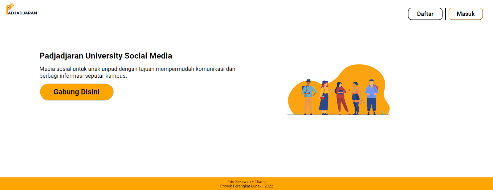
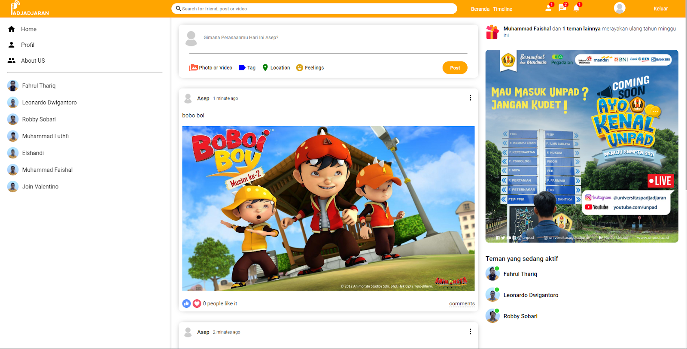

# PadjadjranHub APIs
APIs for PadjadjranHub built with NodeJs, ExpressJs, and MongoDB. PadjadjaranHub is a web-based social media application that makes it easier for students of Padjadjaran University to communicate with each other. The application has several features such as following and unfollowing other users, updating personal status, and liking and unliking posts.

 

## User Guides

* Click the link https://padjadjaran-hub.com/
* Go to the register menu to sign up. Enter your name, email, password, and confirm password.
    - There are some requirements for signing up, such as: username must not be the same as another user's, email must have the @ symbol in it, and password must be at least 6 digits long and must be confirmed again.
* After successfully registering, the user can immediately log in to the application through the login page, using the email and password that was registered.
* On the main page of the application, the user can see the content of the application. For new users, the content page will be empty.
* Make a choice to follow other users by clicking https://padjadjaran-hub.com/profile/Leonardo%20Dwigantoro and then press the follow button.
* Then go back to the main page and the posts of the users you are following will be visible.
* The user can also make posts, including photos and text messages.
* The user can like and unlike their own and other people's posts.
* The user can unfollow other users that they have previously followed.
* After using PadjadjaranHub, the user can log out and return to the main page menu.

